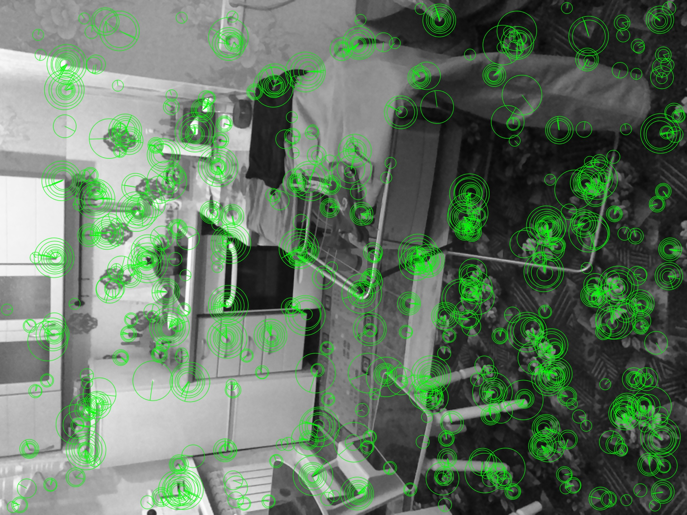

[TOC]

# Задача-01: Оптимизировать скорость работы (производительность) ORB-SLAM3 `ORBextractor.cc` минимум в 2 раза (на iOS платформе).


## Требуемое рабочее окружение

Перед началом работ убедитесь что у вас настроено след минимальное
рабочее окружение:

1. Компьютер с установленной MacOS Catalina

2. Xcode v12.4: https://developer.apple.com/xcode/

3. Cocoapods v1.10.1: https://guides.cocoapods.org/using/getting-started.html

4. Apple ID (FREE Individual Apple Developer Program)
   для запуска iOS кода на эмуляторе и/или на реальном iOS устройстве.
   Зарегестрируйте свой Apple ID если у вас его нет.
   
   **ВНИМАНИЕ**: Покупки Apple Developer Program НЕ требуется, достаточно будет
                 индивидуальной бесплатной лицензии Apple. 

5. Эмульятор iOS v14.X (можно последнюю версию iOS v14.4.1).

6. Реальное устройство (iPhone / iPad) с установленной iOS v14.X 
   (можно последнюю версию iOS v14.4.1). Минимальные требования к 
   модели телефона: iPhone 8, или iPad (5-го поколения).


## Описание задачи

1. Имеется сторонний ORB-SLAM3 ORBextractor

    + https://github.com/UZ-SLAMLab/ORB_SLAM3/blob/master/include/ORBextractor.h

    + https://github.com/UZ-SLAMLab/ORB_SLAM3/blob/master/src/ORBextractor.cc


2. С помощью этого экстрактора можно производить расчет ключевых точек (SLAM) по кадру
   (картинка из видео потока, поступающего от AR камеры iOS приложения).


3. В своей работе (под капотом) экстрактор использует функции OpenCV2 библиотеки.


4. iOS клиент настроен на работу с OpenCV2 v3.4.10


5. По данной ссылке пример кадра [luma-frame.bin](doc/luma-frame.bin) (цвет схема Luma, разрешение 1920x1440) в формате,
   отдаваемом AR камерой iOS приложения в видео потоке.
   Ниже PNG представление этого кадра (для ознакомления):

   


6. Пример кода для вызова функции расчета ключевых точек ORBextractor-a (для ознакомления):

```
#include <chrono>
#include <io.h>
#include <iostream>
#include <opencv2/opencv.hpp>
#include "ORBextractor.h"

using namespace cv;

int main() {
    ORB_SLAM3::ORBextractor *orb_extractor = new ORB_SLAM3::ORBextractor(1000, 1.5f, 4, 20, 7);

    int y_plane_width = 1920;
    int y_plane_height = 1440;
    int y_plane_bytes_per_row = y_plane_width;
    int N = y_plane_width * y_plane_height;

    void *y_plane_bytes = (char*) malloc(N);

    try {
        FILE *fp = 0;
        fopen_s(&fp, "luma-frame.bin", "rb");
        if (fp) {
            fread(y_plane_bytes, 1, N, fp);
        }
        fclose(fp);
    } catch (std::exception& ex) {
        std::cout << "Exception occurred!" << std::endl;
    }

    // yPlane (Luma values)
    Mat y_plane = Mat(y_plane_height, y_plane_width, CV_8U, y_plane_bytes, y_plane_bytes_per_row);

    // NOTE [smuravev] Мы передаем формируем массив v_lapping_area со значениеями [1, 0] внутри.
    //                 Это гарантирует что в работе `ORBextractor::operator()` НЕ будет использоваться
    //                 'stereo fisheye' условие при расчете features points (descriptors) - а будет
    //                 использоваться ТОЛЬКО `monoIndex` (одна камера) - см. тело (реализацию) `ORBextractor::operator()`
    std::vector<int> v_lapping_area;
    v_lapping_area.push_back(1);
    v_lapping_area.push_back(0);

    cv::Mat orb_descriptors;
    std::vector<cv::KeyPoint> key_points;

    auto start_timestamp = std::chrono::system_clock::now();

    // !!! ЗДЕСЬ ВЫЗЫВАЕМ РАСЧЕТ КЛЮЧЕВЫХ ТОЧЕК
    orb_extractor->operator()(y_plane, cv::noArray(), key_points, orb_descriptors, v_lapping_area);

    auto end_timestamp = std::chrono::system_clock::now();
    std::chrono::duration<double> elapsed = end_timestamp - start_timestamp;
    std::cout << "elapsed time: " << elapsed.count() << " sec" << endl;

    cv::drawKeypoints(
        y_plane,
        key_points,
        y_plane,
        cv::Scalar(0, 255, 0, 128),
        cv::DrawMatchesFlags::DRAW_RICH_KEYPOINTS
    );

    bool result = cv::imwrite("compatibility-optimized-1920x1440.jpg", y_plane);
    if (result) {
        std::cout << "compatibility-optimized-1920x1440.jpg - DONE" << endl;
    } else {
        std::cout << "compatibility-optimized-1920x1440.jpg - FAILED" << endl;
    }
}
```


7. В файле [compatibility-optimized-1920x1440.jpg](doc/compatibility-optimized-1920x1440.jpg) вы можете видеть отрисованный
   пример всех найденных ключевых точек на нашем кадре (позиция, ориентация, радиус):
   
   


8. Цель и требования к выполнению задачи:

    + Оптимизировать код `ORBextractor.cc`, чтобы повысить его
      производительность в 2 раза.

    + Важно производить контрольные запуски и проверки производительности на реальном iOS телефоне (не эмулятор iOS,
      не Android, не desktop компьютер с другой ОС и т.п.) - так как другие платформы будут задействовать
      часть GPU (библиотекой OpenCV2).
      Нам важно работать именно с iOS сборкой OpenCV2 для iOS.
      И запускать на iOS чтобы сравнивать показатели производительности именно на этой платформе (именно
      с теми GPU вызовами, которое предоставляет OpenCV2 сборка для iOS).
      

## Приемка (сдача) выполненной работы.

**ВАЖНО**:

1. Отладка и оптимизация может выполняться на эмуляторе iOS.
Но контрольные показатели должны ВСЕГДА сниматься используя реальное устройство.


2. Проделанная работы (результаты), будет приниматься именно по результатам
тестов выполненных на РЕАЛЬНОМ iPhone / iPad.